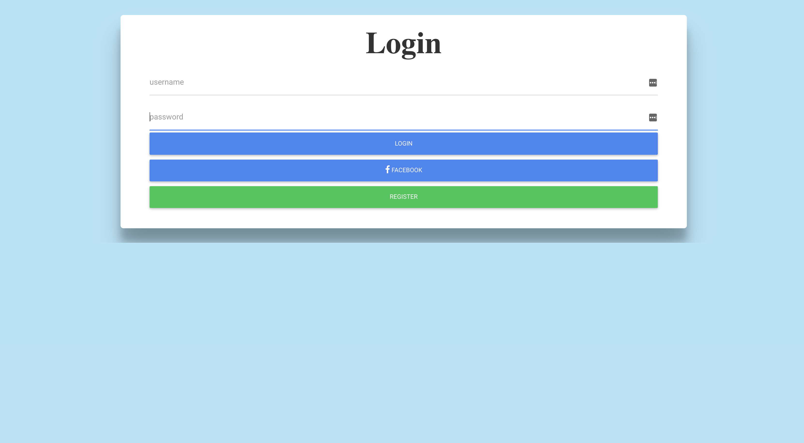
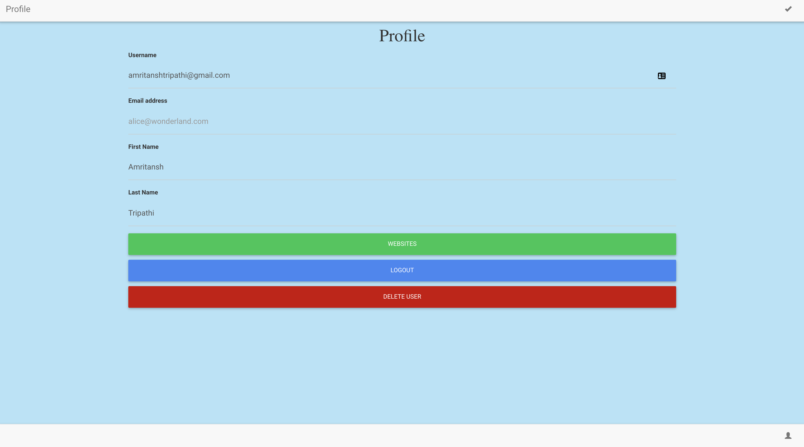
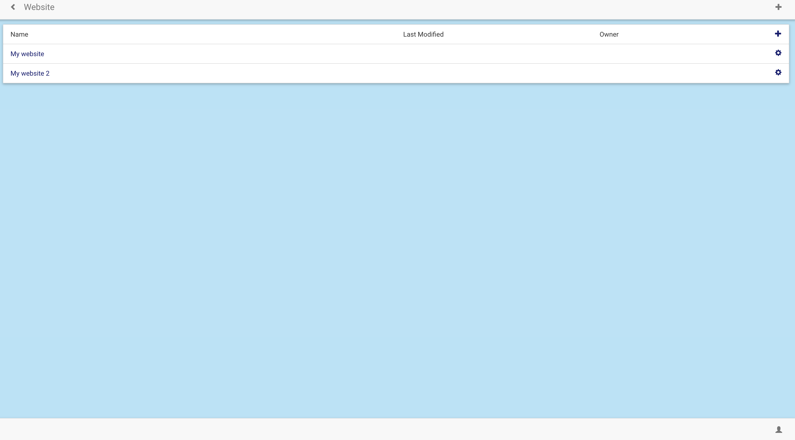
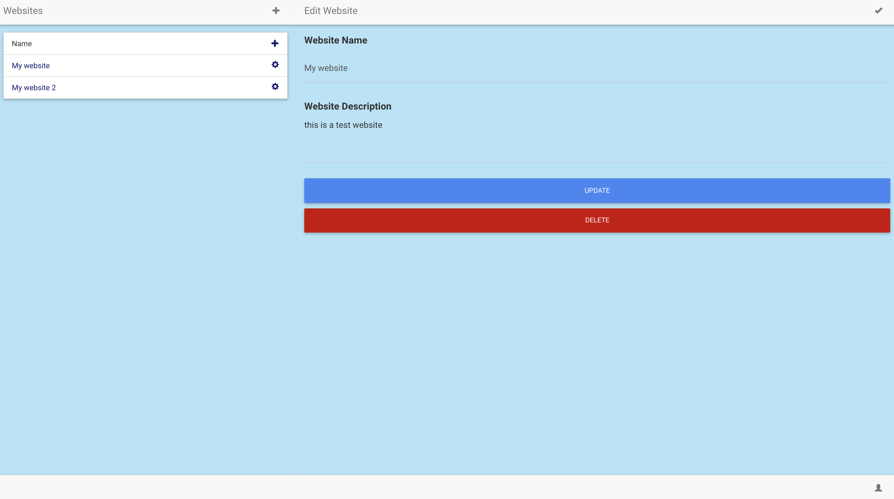
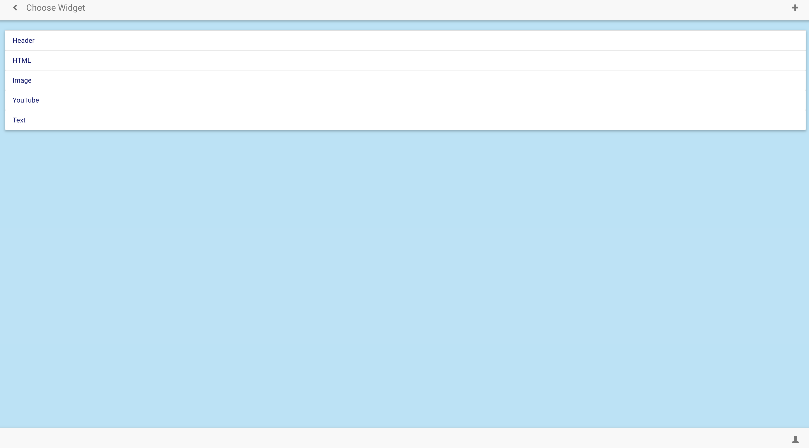

    
### Description

The project was aimed at creating blogging websites where a user can create a blogging application in the browser itself. A blogging application can have pages and each page can have a widget. A widget can have a youtube video, images, text or header. Widgets can be dragged and dropped to change their position on a page.

### Functions and Features

The web application maker can have many users. A user can create a new account or login using Facebook authentication. One user can create many different blogging websites and each website can have many pages. Widgets in pages can be reordered using drag and drop action and the final position of the widget will persist the next time page is loaded.

### Tools and Technologies used

* Backend: NodeJS, PassportJS
* Frontend: AngularJS
* Database: MongoDB
* Version Control: Github

### To run the project

1. git clone https://github.com/tripathiamritansh/WebAppMaker.git
1. cd web-dev-template
1. npm install
1. mongod
1. node server.js
1. browse to localhost:3000
